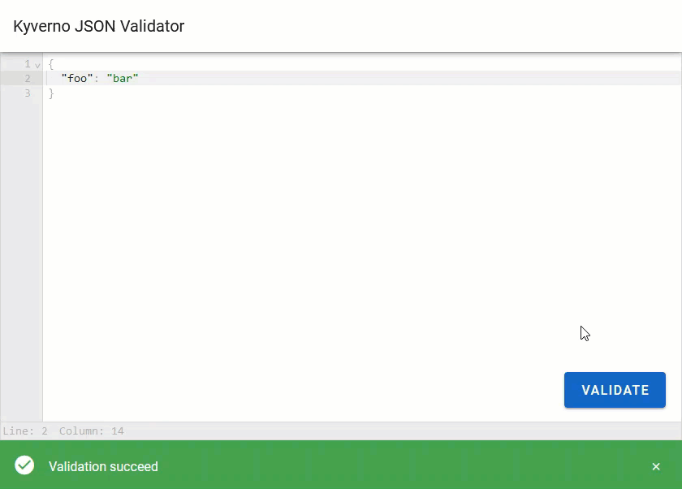

# Kyverno JSON Validator

This repo is for an **experimental only** demo application which shows how Kyverno can be used to validate non-Kubernetes resources (i.e., generic JSON). It only aims to do two things: provide a basic UI for the purposes of testing and demonstrate how users who really want this capability today might do so by viewing some code.

## Installation

See installation instructions in the Helm chart's README [here](/charts/kyverno-json-validator/README.md#installing-the-chart).

## Usage

The chart will install the CRD which maps onto a generic JSON payload with pseudo-Kubernetes Custom Resource called `MyJson`. Install a matching Kyverno policy which contains the validation you wish to make.

```yaml
apiVersion: kyverno.io/v1
kind: ClusterPolicy
metadata:
  name: json-test
spec:
  background: false
  validationFailureAction: Enforce
  rules:
  - name: test
    match:
      any:
      - resources:
          kinds:
          - MyJson
    validate:
      message: The value of `foo` must be set to `bar`.
      pattern:
        spec:
          foo: bar
```

Navigate to the UI using the link provided after the chart was installed (which varies depending on whether you used the default of ClusterIP or LoadBalancer) and validate the JSON payload you wish. Validation failures return the message from Kyverno defined in the `message` field of the matching policy.


